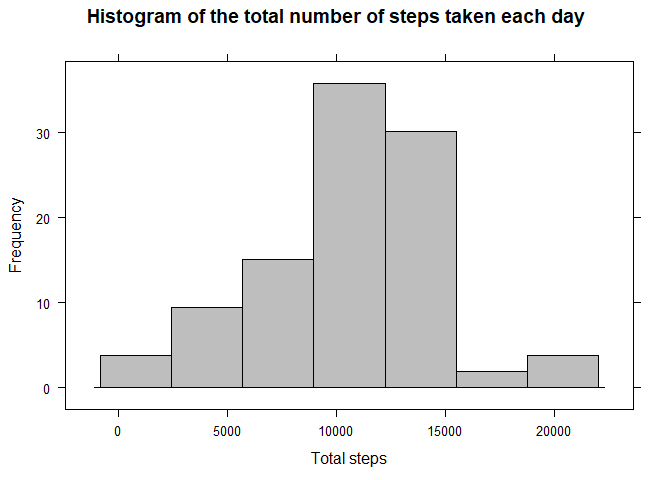
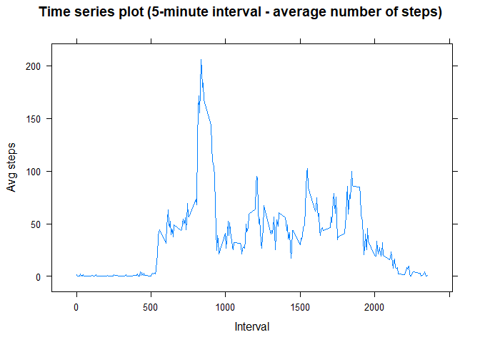
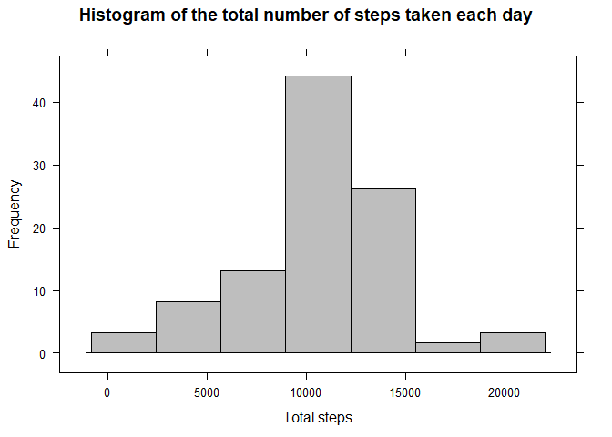
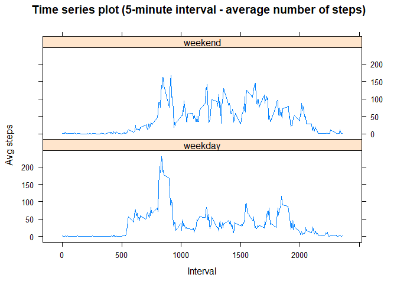

## Loading and preprocessing the data

### Load data


```r
library(dplyr)
library(ggplot2)
library(lattice)

df <- read.csv(unz("./activity.zip", "activity.csv"))
```

### Process/transform the data


```r
df$date <- as.Date(df$date, format = "%Y-%m-%d")
head(df)
```

```
##   steps       date interval
## 1    NA 2012-10-01        0
## 2    NA 2012-10-01        5
## 3    NA 2012-10-01       10
## 4    NA 2012-10-01       15
## 5    NA 2012-10-01       20
## 6    NA 2012-10-01       25
```

## What is mean total number of steps taken per day?

### Ignore the missing values in the dataset.


```r
tsdf <- df %>%
        filter(!is.na(df$steps)) %>%
        group_by(date) %>%
        summarise(total_steps = sum(steps))
```

### Make a histogram of the total number of steps taken each day


```r
histogram(
        ~total_steps,
        data = tsdf,
        xlab = "Total steps",
        ylab = "Frequency",
        col = "gray",
        main = "Histogram of the total number of steps taken each day"
)
```

<!-- -->


### Calculate and report the mean and median of the total number of steps taken per day

#### Mean:


```r
me <- mean(tsdf$total_steps)
me
```

```
## [1] 10766.19
```

#### Median:


```r
md <- median(tsdf$total_steps)
md
```

```
## [1] 10765
```

## What is the average daily activity pattern?

### Make a time series plot (i.e. \color{red}{\verb|type = "l"|}type = "l") of the 5-minute interval (x-axis) and the average number of steps taken, averaged across all days (y-axis)

#### Calculate average number of steps taken per interval


```r
aisdf <- df %>%
        filter(!is.na(df$steps)) %>%
        group_by(interval) %>%
        summarise(avg_steps = mean(steps))
```

#### Make a time series plot


```r
xyplot(
        avg_steps ~ interval,
        data = aisdf,
        type = "l",
        xlab = "Interval",
        ylab = "Avg steps",
        main = "Time series plot (5-minute interval - average number of steps)"
)
```

<!-- -->

### Which 5-minute interval, on average across all the days in the dataset, contains the maximum number of steps?


```r
aisdf[which.max(aisdf$avg_steps), ]$interval
```

```
## [1] 835
```

## Imputing missing values

### Calculate and report the total number of missing values in the dataset (i.e. the total number of rows with \color{red}{\verb|NA|}NAs)


```r
is_missing <- is.na(df$steps)
sum(is_missing)
```

```
## [1] 2304
```

### Devise a strategy for filling in all of the missing values in the dataset.

#### We use the mean number of steps for that 5-minute interval to fill its steps.


```r
mitvs <- sapply(df$interval, function(itv){ aisdf$avg_steps[aisdf$interval == itv] })
```

#### Filling in all of the missing values


```r
mvs <- mitvs[is_missing]
```

### Create a new dataset that is equal to the original dataset but with the missing data filled in.

#### Create a new dataset


```r
df2 <- df
df2$steps[is_missing] <- mvs
```

#### Check the dataset


```r
sum(is.na(df2$steps))
```

```
## [1] 0
```

### Make a histogram of the total number of steps taken each day and Calculate and report the mean and median total number of steps taken per day. Do these values differ from the estimates from the first part of the assignment? What is the impact of imputing missing data on the estimates of the total daily number of steps?

#### Make histogram


```r
tsdf2 <- df2 %>%
        group_by(date) %>%
        summarise(total_steps = sum(steps))

histogram(
        ~total_steps,
        data = tsdf2,
        xlab = "Total steps",
        ylab = "Frequency",
        col = "gray",
        main = "Histogram of the total number of steps taken each day"
)
```

<!-- -->

#### Calculate and report the mean and median

Mean


```r
me2 <- mean(tsdf2$total_steps)
me2
```

```
## [1] 10766.19
```

Median


```r
md2 <- median(tsdf2$total_steps)
md2
```

```
## [1] 10766.19
```

#### Do these values differ from the estimates from the first part of the assignment? **Yes**


```r
print(paste("Before filling mean = ", me, "after filling mean = ", me2))
```

```
## [1] "Before filling mean =  10766.1886792453 after filling mean =  10766.1886792453"
```

```r
print(paste("Before filling median = ", md, "after filling median = ", md2))
```

```
## [1] "Before filling median =  10765 after filling median =  10766.1886792453"
```

#### What is the impact of imputing missing data on the estimates of the total daily number of steps?

- **Mean is not changed**

- **Median is shifted to the right**


## Are there differences in activity patterns between weekdays and weekends?

### Create a new factor variable in the dataset with two levels – “weekday” and “weekend” indicating whether a given date is a weekday or weekend day


```r
df2$week <- sapply(df2$date,
       function(d) {
               if_else(weekdays(d) %in% c("Saturday", "Sunday"), "weekend", "weekday")
       })
```


### Make a panel plot containing a time series plot (i.e. \color{red}{\verb|type = "l"|}type = "l") of the 5-minute interval (x-axis) and the average number of steps taken, averaged across all weekday days or weekend days (y-axis)


```r
aisdf2 <- df2 %>%
        group_by(interval, week) %>%
        summarise(avg_steps = mean(steps))
```

```
## `summarise()` has grouped output by 'interval'. You can override using the `.groups` argument.
```

```r
xyplot(
        avg_steps ~ interval | week,
        data = aisdf2,
        type = "l",
        layout = c(1, 2),
        xlab = "Interval",
        ylab = "Avg steps",
        main = "Time series plot (5-minute interval - average number of steps)"
)
```

<!-- -->


